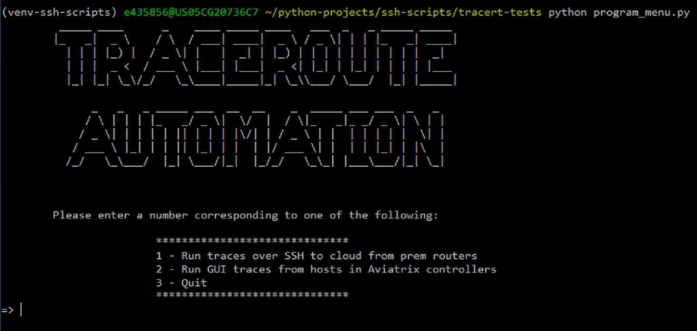
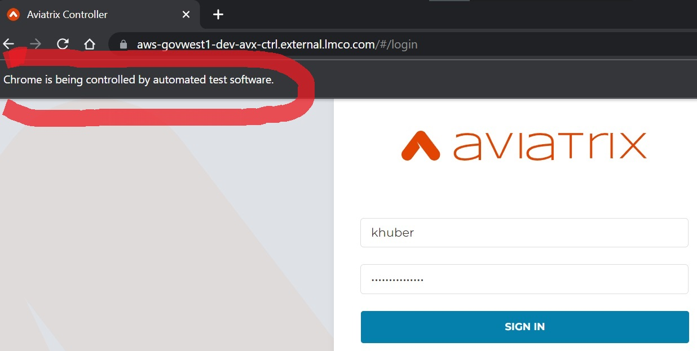
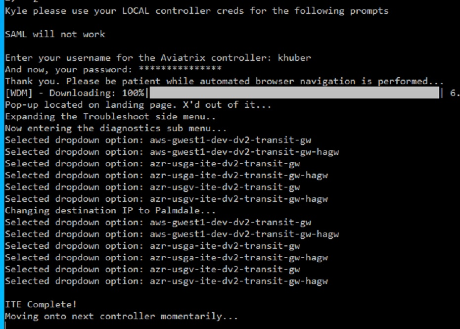

    
    
    

**To run this script on your local machine:**

*PREREQUISITES*
1.  This script has been fully tested running Windows Bash shell emulation (should also work on modern native Bash >= v4.4)
    
    *Other shell configurations (cmd, Powershell, zsh) are not supported at this time.*

    In order to run the optional 'GUI mode' for reverse traceroutes (menu option 2), you will need to be a member of the DV2 Cloud-Core team, as the script will check an OS environmental variable against the names we've placed in RBAC on the Aviatrix controllers. This is because it later needs to pass your credentials into the automated web browser session (if the script can't match your LM NTID with the names in RBAC, you will be told it cannot proceed, even if you opt in to running the GUI mode).

    **Additonally, to run the GUI portion of the script, you will need Google Chrome installed, as the script pulls the latest version of a specific driver into the project dir each run, and spawns a process from this.**    

2.  For best compatibility, ensure your virtual environment, or primary Python version in PATH meets or exceeds that used here (v3.8.1).
3.	After cloning, ensure you "*cd*" into the *tracert-tests* directory.
4.  Run *pip install -r ./requirements.txt* from here.
5.	For security, I do not commit the referenced **“secrets.py”** file in **tracert.py**.

    - PM me for the code needed to be placed in this file (it's just 2 variables and an encoding command).

6. Save these variables in a file named *secrets.py*, in the same project directory level
7. Once you're all set, simply execute *python program_menu.py* from within the tracert-tests directory, and relax for 5 minutes while it runs through everything. Output will be provided to you at various stages, so that you know what's going on. Log files from the SSH sessions will be saved into the project folder, cleaned of banner MOTD's, and formatted in an organized fashion.

*At this time, the GUI mode requires you to manually copy/paste the output from the text area you'll be brought to within the Aviatrix controller/s, for each automated host trace (if desired). A message box will be displayed, and will pause the script execution until you confirm you're ready for the automated selections to proceed*
